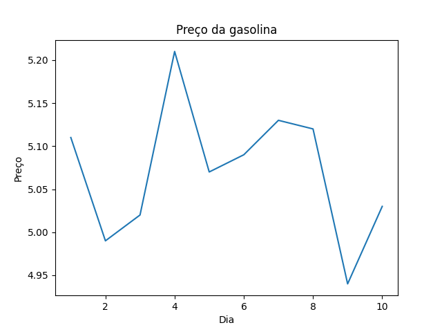

# Análise de Variação do Preço da Gasolina

Durante os dez dias analisados, observamos uma variação significativa no preço da gasolina. Os fatores que podem ter contribuído para essas variações incluem variação do dolar em frente ao real e o preço do petróleo.

## Gráfico de Variação do Preço da Gasolina

